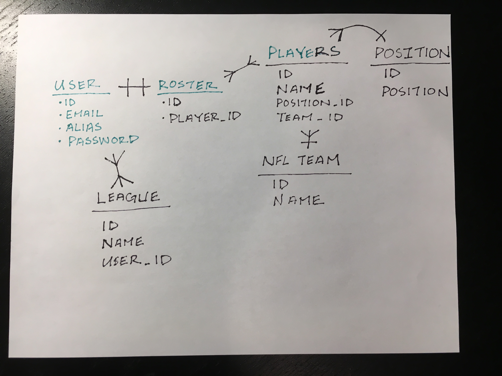
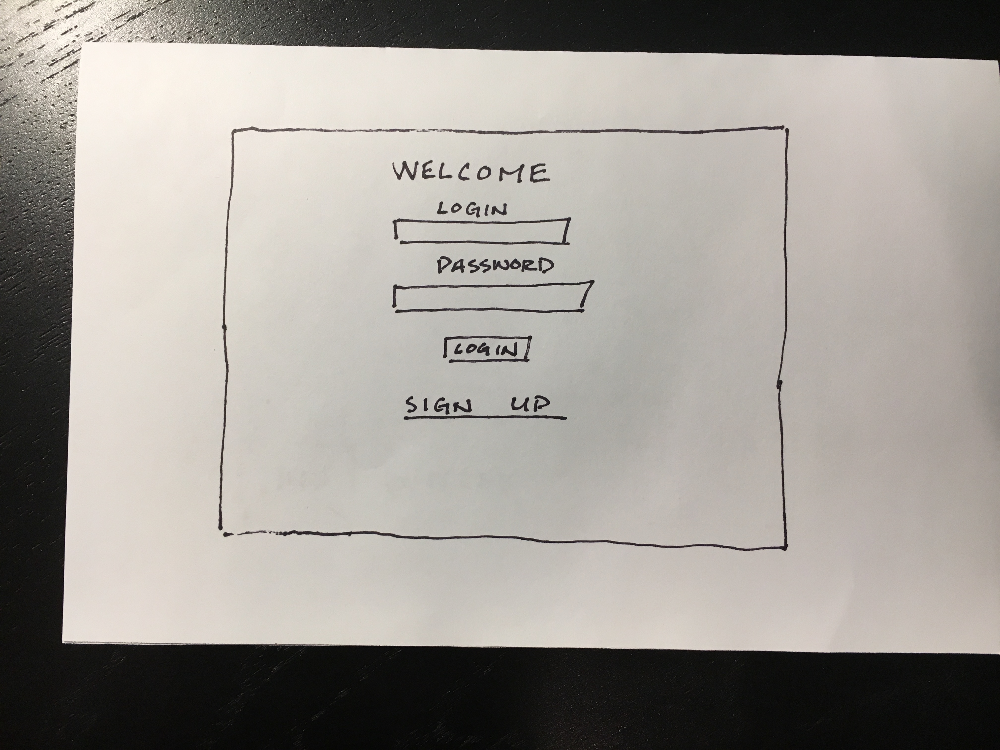
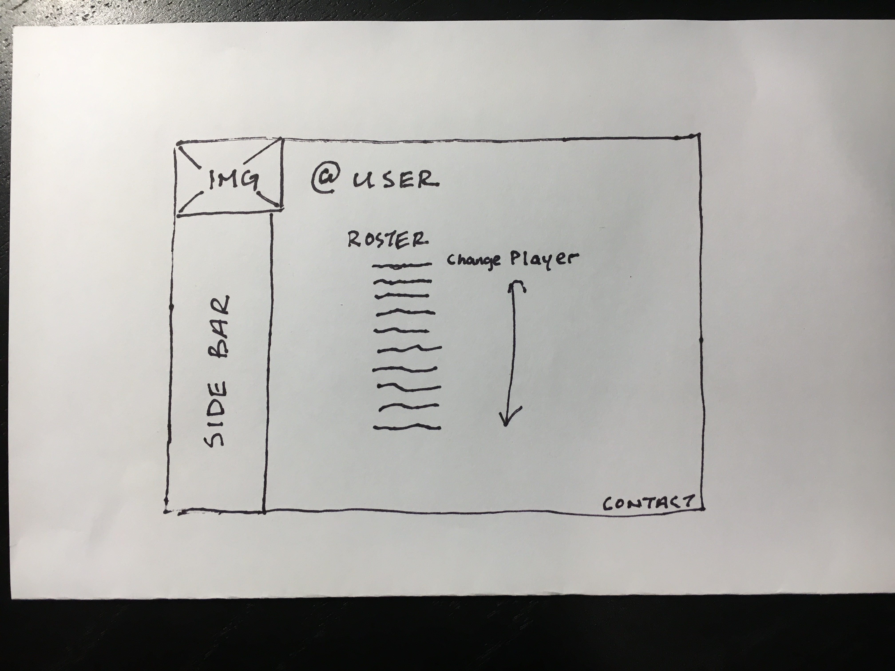
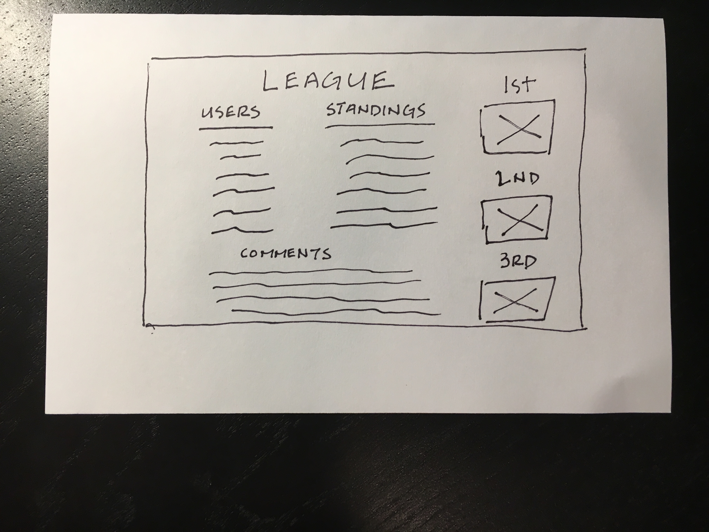
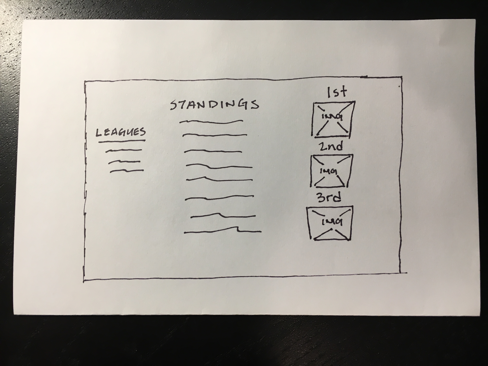

#Not Really Football
-
##Introduction
Not Really Football is fantasy football rails app that allows you to compete with other users in a weekly competition.  Users will be able to create an account and select players to their team to see how it stacks up against another user's team.

##Technologies Used
Ruby on Rails

##User Stories
[User Stories](https://trello.com/b/i7mWIqvq/project-2)

##ERB

##Wireframes

###Login

###User

###League

###Global Standings

##MVP
A Fully Functional CRUD Application that allows users to 